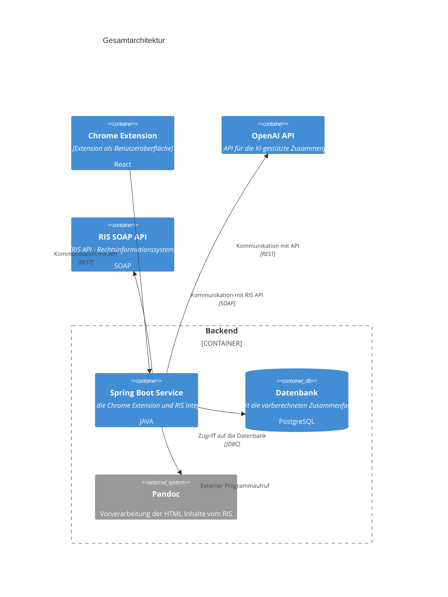

```mermaid
C4Component
    title Gesamtarchitektur
    Container(ext, "Chrome Extension", "Extension als Benutzeroberfläche", "React")
    Container_Boundary(services, "Backend", "") {
        
        Container(api, "Spring Boot Service", "API für die Chrome Extension und RIS Integration", "JAVA")
        ContainerDb(db, "Datenbank", "Speichert die vorberechneten Zusammenfassungen", "PostgreSQL")
        System_Ext(pandoc, "Pandoc", "Vorverarbeitung der HTML Inhalte vom RIS")
    }
    Container(openai, "OpenAI API", "Externe API für die KI-gestützte Zusammenfassung")
    Container(ris, "RIS SOAP API", "RIS API - Rechtsinformationssystem", "SOAP")
    Rel(ext, api, "Kommunikation mit API", "REST")
    Rel(api, db, "Zugriff auf die Datenbank", "JDBC")
    Rel(api, pandoc, "Externer Programmaufruf")
    Rel(api, ris, "Kommunikation mit RIS API", "SOAP")
    Rel(api, openai, "Kommunikation mit API", "REST")

    
    UpdateRelStyle(ext, api, $offsetX="-180", $offsetY="-40")
    UpdateRelStyle(api, db, $offsetX="-50", $offsetY="50")
    UpdateRelStyle(api, pandoc, $offsetX="60", $offsetY="70")
    UpdateRelStyle(ext, api, $offsetX="-180", $offsetY="-40")
    UpdateRelStyle(api, ris, $offsetX="100", $offsetY="-60")
    UpdateRelStyle(api, openai, $offsetX="40", $offsetY="-40")
    
```

